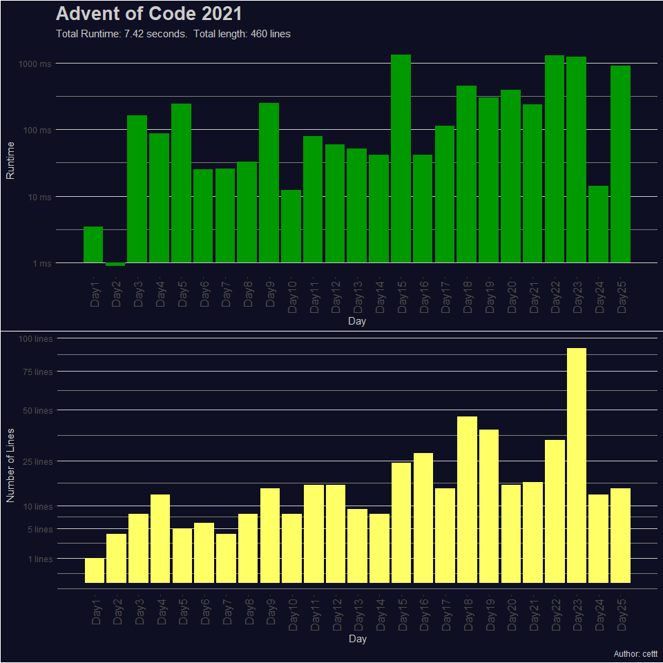

<a href = 'https://adventofcode.com/2021'> Advent of Code 2021 </a>
================

# Summary

Advent of Code is annual event which consits of daily programming
puzzles. The event is hosted by [Eric Wastl](http://was.tl/) and takes
place between December 1st and December 25th.

I solved all puzzles using R (version 4.1.0). Most of the solutions only
require base packages only. For Days 15 and 23 I used the
[collections](https://cran.r-project.org/web/packages/collections/index.html)
library which provides high performance container types (in particular
priority queues).

I try to go for fast and short solutions which means that the resulting
code is not always as easy to read as it could be.

