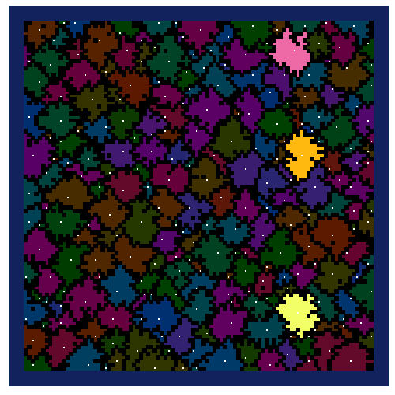
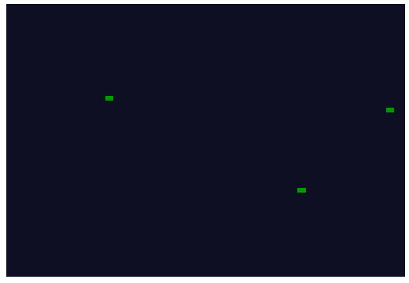
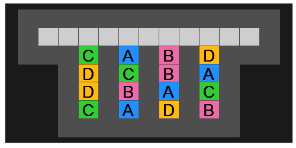
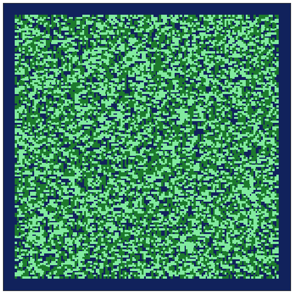

```{r setup, include=FALSE}
knitr::opts_chunk$set(echo = TRUE, collpase = TRUE, out.width = "100%")
```

# Summary

Advent of Code is annual event which consits of daily programming puzzles.
The event is hosted by [Eric Wastl](http://was.tl/) and takes place between December 1st and December 25th.

I solved all puzzles using R (version 4.1.0). Most of the solutions only require base packages.
For Days 15 and 23 I used the [collections](https://cran.r-project.org/web/packages/collections/index.html) library which provides high performance container types (in particular priority queues). 

I try to go for fast and short solutions which means that the resulting 
code is not always as easy to read as it could be.


```{r, echo = FALSE, message=FALSE, warning= FALSE, fig.width=10, fig.height=10}
library(tidyverse)

print(readRDS("Output/AoC2021_results.RDS"))
```

### Day 09


### Day 13


### Day 23


### Day 25

